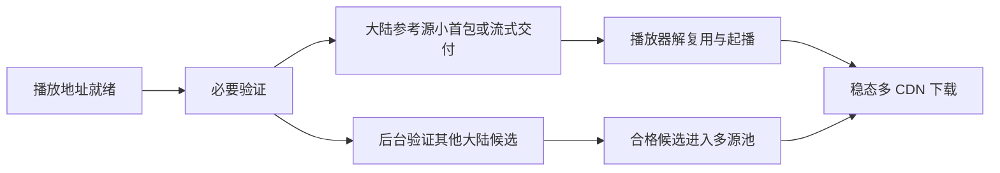

# PiliPlus 点播起播优化需求与验证计划

调研日期：2026-09-23。状态：需求草案，未实施。

用户反馈是：开启多 CDN 功能后，初始载入明显变慢，开始播放后的流畅度明显改善。本计划目标是缩短起播等待，同时保留已经观察到的稳态收益。2026-09-23 的研究阶段没有修改业务源码、编译、重新测试或推送；2026-09-24 仅将规划迁入项目文档。`NET-01`～`NET-16` 仍未实施。

## 1. 依据与结论边界

| 依据 | 本轮确认的内容 | 不能据此推出的结论 |
| --- | --- | --- |
| 用户实际播放反馈 | 起播慢，播放后改善 | 尚不能量化平均收益，也不能定位具体慢节点 |
| 本地 V2 静态代码 | 存在多项先于首包完成的准备工作 | 尚未证明用户那次播放分别耗时多少 |
| BTR 最新发布源码 | 可以核对其起播、调度、续传等做法 | BTR 自报性能不能视作 PiliPlus 的测试结果 |
| 既有 V2 验证文档 | 记录过起播等待、短片段和原生播放检查 | 不是本轮新测量，也不是用户网络的完整性能画像 |

BTR 基线是 [0.9.4.2](https://github.com/MrTangLuyao/Bilibili-thread-ripper/releases/tag/0.9.4.2)，发布于 2026-09-23 04:00 UTC，提交 `847848a412ae8c648a95367972bb338d8196efcb`。查询时主分支多一个 README/速度图提交，下载源码与发布版一致。下文源代码引用均锁定发布提交。

本地分析基线为 `15656d2182ef6c976a534c02f20820abc9e14ce7`。以下“可能原因”来自代码与现象的对应关系，尚待后续时序记录验证。

## 2. 为什么目前可能“起播慢、之后快”

V2 在每个播放器 HTTP 请求中先建立计划，再读取首块。首批字节的关键路径如下：

| 可能原因 | 已核对的代码行为 | 对需求的启发 |
| --- | --- | --- |
| 首位节点等待 | 探测并发发出，但按固定候选顺序取结果 | 大陆优先与大陆组内固定等待是两个规则，需要分别讨论 |
| 起播前额外请求 | 参考源先读 1 字节探测，再先后读首部、中部各最多 4 KiB | 首源自身开始服务，不必等待所有多源混用准备完成 |
| 首块较大 | 首块与稳态块使用同一设置，默认 1 MiB、最大 4 MiB，完整读完才输出 | 起播交付粒度应独立于稳态块大小 |
| 音视频争用额度 | 准备、校验、音视频媒体共用连接额度，未区分用途优先级 | 音频、头部及播放器正等的数据需要优先机会 |
| 请求间重复准备 | 验证结果属于单次计划；每个下游请求拥有独立 HTTP 客户端 | 需要会话级验证缓存及连接复用设计 |
| 后续并发终于生效 | 首块之后进入多源滑动窗口 | 与“播放后改善”相符，应避免优化起播时破坏该收益 |

证据：[准备入口与首块](../../lib/http/cdn_playback_proxy.dart#L195)、[候选等待及采样](../../lib/http/cdn_playback_proxy.dart#L463)、[完整分块读取](../../lib/http/cdn_playback_proxy.dart#L395)、[额度调度](../../lib/http/cdn_playback_proxy.dart#L142)、[请求级客户端](../../lib/http/cdn_playback_proxy.dart#L737)。

读取中部样本可能使未缓存内容提前回源，从而增加等待，这是待验证假设。当前没有缓存命中信息，不能确认“海外缓存未命中”就是这次慢起播的唯一原因。

V2 给本地代理播放设置的 60 秒网络等待上限只避免播放器过早放弃，不会使下载更快。下一版不以继续延长等待上限作为主要优化。[播放器选项](../../lib/plugin/pl_player/controller.dart#L898)

## 3. BTR 中哪些解决方法值得借鉴

| 方法 | BTR 的实现要点 | PiliPlus 的取舍 |
| --- | --- | --- |
| 连接预热 | 视频准备时预连接候选 CDN | 借鉴连接复用/轻量预热；浏览器标签不能直接移植 |
| 缓存头部与索引 | 按媒体表示保存，seek 复用 | 缓存验证及必要头信息，避免重复准备 |
| 首段渐进交付 | 先给小首块，后续有序交付，并留出音频和补救额度 | 优先采用“起播小、稳态大”与轨道公平性 |
| 用途优先队列 | 头/索引、起播、普通数据分层 | 优先实现用途分类，减少预取挡住起播 |
| 起播目标稳定 | 首段完成时计算一次，避免等待越久目标越大 | 不让起播目标不断后移；不照抄浏览器秒数 |
| 断点续传 | 保留已确认的连续前缀，失败后只补尾部 | 下一阶段降低重复下载和恢复等待 |
| 提前更新地址 | 签名将过期时换新地址，并防止旧响应覆盖新地址 | 支持长视频和长时间暂停恢复 |
| 自适应与备份请求 | 动态块大小、线程数、有限重复请求 | 分开试验；保留手动覆盖及流量限制 |

代码依据：[预连接](https://github.com/MrTangLuyao/Bilibili-thread-ripper/blob/847848a412ae8c648a95367972bb338d8196efcb/src/page-hook.js#L639-L662)、[头部缓存](https://github.com/MrTangLuyao/Bilibili-thread-ripper/blob/847848a412ae8c648a95367972bb338d8196efcb/src/native-mse-player.js#L422-L456)、[首段渐进交付](https://github.com/MrTangLuyao/Bilibili-thread-ripper/blob/847848a412ae8c648a95367972bb338d8196efcb/src/idm-downloader.js#L983-L1079)、[固定起播目标](https://github.com/MrTangLuyao/Bilibili-thread-ripper/blob/847848a412ae8c648a95367972bb338d8196efcb/src/native-mse-player.js#L502-L517)、[地址刷新](https://github.com/MrTangLuyao/Bilibili-thread-ripper/blob/847848a412ae8c648a95367972bb338d8196efcb/src/page-hook.js#L539-L585)。

## 4. 地理优先策略：保持什么，哪些需要另行选择

最新 BTR 并非纯地理排序：起播候选也包含接口原始地址，之后还会使用实测速度信息。直接整体移植可能违反此前“不要按速度或时延选择 CDN”的要求。[BTR 起播候选与备用源排序](https://github.com/MrTangLuyao/Bilibili-thread-ripper/blob/847848a412ae8c648a95367972bb338d8196efcb/src/cdn-resolver.js#L284-L304)

| 策略 | 是否作为本草案默认 | 理由/边界 |
| --- | --- | --- |
| 优先已知大陆服务域名，失败后才用其他地区 | 是，延续 V2 | 域名分类不等于实时物理位置或缓存命中保证 |
| 固定参考源先交付，其他大陆源后台校验 | 是，优先研究 | 无需按速度重排候选即可减少前置准备 |
| 启用功能时停用原手选 CDN | 是，延续 V2 | 关闭功能后恢复旧设置 |
| 在大陆组内选择首先成功的候选 | 可选，需确认策略 | 保留地区优先，但引入了同组响应时间因素 |
| 大陆组内按速度分配更多分块 | 可选，默认关闭 | 明确属于性能排序，不能暗中启用 |
| 起播直接竞争海外原始地址 | 不作为默认 | 与严格大陆优先冲突 |
| 自动并发数 | 可选、保留固定档位 | 它可独立于 CDN 排名，但会改变连接数量和流量 |
| 自适应块大小 | 可选、保留固定块 | 它可独立于 CDN 排名；应明确设置是固定值还是上限 |

首源先输出不等于取消内容校验。其他 CDN 的字节只有完成必要的资源身份检查后才能混入。跨源身份、源内资源变化、Range 完整性、签名与地区规则都应保留。

## 5. 需求列表与优先级

### P0：首先修复起播路径

| ID | 需求 | 可检查的结果 |
| --- | --- | --- |
| NET-01 | 记录完整起播时间线 | 可区分地址获取、排队、CDN 首字节、校验、代理首包、首帧和首音频 |
| NET-02 | 分离起播交付与稳态块大小 | 即使用户设为 4 MiB，也不必等完整 4 MiB 才首次交付 |
| NET-03 | 多源准备渐进进行 | 一个合格大陆参考源可先服务；非必要后台校验不阻塞首包 |
| NET-04 | 会话内复用验证与连接 | 相同轨道的 Range/seek 不重复进行无必要的全套准备；换资源正确失效 |
| NET-05 | 头部、起播和音频有调度保障 | 视频预取饱和时，音频起始请求仍能及时获得额度 |
| NET-06 | 保持地区策略与故障回退 | 默认策略不因响应快慢跨地区；失败不会把不一致资源拼进响应 |
| NET-07 | 可控的准备与后台工作预算 | 探测、校验、预取均有额度；取消后释放，不继续下载旧视频 |

这是建议结构，并非已经实现。小首包的最终数值需通过媒体类型和 mpv 请求行为验证；64 KiB 可作为实验起点，不能把 BTR 的数值直接视为最佳值。

### P1：提升持续播放与故障恢复

| ID | 需求 | 可检查的结果 |
| --- | --- | --- |
| NET-08 | 保留已校验连续字节，重试只补缺失部分 | 中断恢复减少重复流量；跨源续传仍满足内容身份约束 |
| NET-09 | 将节点故障与单个签名地址拒绝分开 | 一个过期/被拒地址不会永久封掉整个服务节点 |
| NET-10 | 在地址即将过期时刷新 | 长暂停恢复不先经历整池 403；旧响应不覆盖更新签名 |
| NET-11 | 强化连续 seek、切画质与音轨切换 | 旧任务结果不覆盖新位置，不误恢复用户主动暂停的状态 |
| NET-12 | 用户可导出性能诊断 | 含阶段耗时、主机、错误类别、有效/重复流量；不暴露完整签名地址与账号凭据 |

### P2：独立试验可选自适应策略

| ID | 需求 | 进入条件 |
| --- | --- | --- |
| NET-13 | 有限额备份请求 | 只救援明显阻塞的数据，控制重复字节和连接占用 |
| NET-14 | 可选自动并发 | 加线程无收益时回退，遇限流降档；固定手动值仍可用 |
| NET-15 | 可选自适应块 | 在请求开销与首包/取消响应之间平衡，解释手动值的优先关系 |
| NET-16 | 播放紧迫性调度 | 先证明能可靠识别轨道、分段位置与播放器缓冲，再加入精确截止时间 |

BTR 对应的自适应规则和模拟结果见 [0.9.3–0.9.4.1 更新记录](https://github.com/MrTangLuyao/Bilibili-thread-ripper/blob/847848a412ae8c648a95367972bb338d8196efcb/CHANGELOG.md#L20-L104)。本项目应独立建立基准，不沿用它的性能结论。

## 6. 为什么不能直接搬运浏览器播放器

PiliPlus 保留 media_kit/mpv，通过本地 HTTP Range 代理供给字节。BTR 全接管模式掌握 SIDX 分段、浏览器播放头和 SourceBuffer，因此能知道具体一段几秒后需要播放。

代理收到某个字节范围，不等于知道其播放时间。未经轨道/分段映射，不能假设能精确移植 BTR 的 deadline 调度。自动并发所需的缓冲下降、卡顿、有效吞吐信号，也必须和 mpv 实际事件对应，避免重复字节被当成收益。

浏览器 MSE 配额、网页内核回跳、DOM 错误、停用网页原有调度器属于另一种运行环境。借鉴生命周期和资源控制原则即可，不把它们列成 mpv 的必修复缺陷。[BTR 分段截止时间来源](https://github.com/MrTangLuyao/Bilibili-thread-ripper/blob/847848a412ae8c648a95367972bb338d8196efcb/src/native-mse-player.js#L480-L499)

## 7. 后续测试矩阵

以下是实施后的计划，本轮没有执行这些测试。

| 场景组 | 必须覆盖的情况 | 重点指标 |
| --- | --- | --- |
| 冷/热起播 | 清空客户端会话后打开；同视频再次打开；热门/冷门内容 | 代理首包、首帧/首音频，中位数与 P95 |
| 网络与节点 | 高时延、连接限速、总带宽不足；首位节点挂起但同组其他正常 | 起播、稳态卡顿、探测及备份成本 |
| 双轨竞争 | 视频先请求、音频稍后请求；反向次序；不同音轨码率 | 音频不饿死、共享并发预算 |
| seek | 缓冲内/外、连续两次跳转、刚起播即跳转、末尾重播 | 恢复时间、过期任务取消、播放位置正确 |
| 质量与状态 | 换清晰度/编码/音轨，仅音频模式，暂停后恢复 | 来源身份、状态连续性、旧缓存失效 |
| 地址与故障 | 签名接近过期、403、429、半块断线、源内容不一致 | 刷新、降载、续传、拒绝错误拼接 |
| 参数边界 | 1/8/32 路、64 KiB/1 MiB/4 MiB | 首包解耦、连接/内存上限、取消浪费 |
| 长时间播放 | 长视频、多分 P、睡眠/唤醒、退出播放 | 内存与连接稳定、无旧任务残留 |
| 平台 | macOS 先验证，再分别验证 Linux、iOS、Windows、Android | 解复用、网络栈及平台生命周期差异 |

“冷启动”首先指客户端会话和连接未预热；没有 CDN 运维证据时，不能宣称已清空或制造服务器端冷缓存。对照应固定账号、视频/分 P、清晰度、编码、设备和网络，并交替测试开关/新旧方案，降低缓存和时段偏差。

## 8. 分期验收与拟定目标

以下数值是讨论用的拟定门槛，不是已完成或保证能达到的结果。

1. **诊断阶段**：能把起播耗时分解到主要阶段，获取用户问题样本的可复现基线；若瓶颈主要在播放地址接口或解码，调整优化重点。
2. **P0 阶段**：问题样本起播中位数相对 V2 争取缩短至少 30%；健康直连样本的起播 P95 额外开销建议不超过 500 ms。每组先至少 5 次筛查，正式 P95 判断需增加到足够样本。
3. **稳定性阶段**：固定 10 分钟窗口比较卡顿次数与累计秒数，不能因首帧更快而明显恶化稳态；seek 恢复也纳入对照。
4. **P1 阶段**：断线/过期/切换场景无错误拼接，旧任务及时取消；比较有效吞吐、重复下载比率、峰值内存、连接数与未播放字节。
5. **P2 阶段**：每项自适应独立开关、单独基准；无收益就维持默认关闭，不把增加线程本身当作成功。

协议正确性是必达门槛：分块重组字节一致，Range/长度正确，跨源身份不混淆，源变化及时拒绝；性能数字不能替代这些检查。

## 9. 直播加速另立需求，不与点播起播混用

BTR 浏览器 0.9.4.0 新增的直播路径面向 **fMP4 HLS 分片**。连续 FLV 没有相同的可独立并行分片结构；该浏览器功能也不能直接视作桌面版已经具备的能力。[官方直播变更说明](https://github.com/MrTangLuyao/Bilibili-thread-ripper/releases/tag/0.9.4.0)

PiliPlus 的直播界面、礼物、粉丝团及互动功能属于独立产品范围。若后续也做直播网络优化，应先记录实际选择的播放协议、地址池、清晰度与播放器请求，分别规划原生 FLV/HLS。不能简单让现有点播 Range 代理处理所有直播地址。

建议先完成 P0 的起播诊断与优化，再推进独立的直播界面需求；直播加速作为单独开关和验收项目，避免把界面改造的成效与网络改造混在一起。
